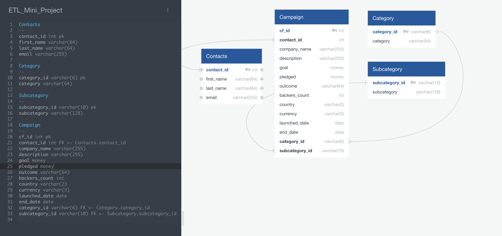

# Crowdfunding_ETL
## Collaboration among Katie Beale, Megan Palma, and Jared Willson

### Summary
This repository contains code to perform ETL (Extract, Transform, and Load) functions against data contained in a "crowdfunding.xlsx" spreadsheet and a "contacts.xlsx" spreadsheet. The spreadsheets are first loaded into Pandas, datatypes examined for accuracy, split into multiple dataframes that will allow for a fully normalized structure within a PostgreSQL database, and any concatenated fields are split into required values. The data for the four normalized tables are saved into four CSV files for import into a database. They are: campaign.csv, category.csv, subcategory.csv, and contacts.csv all within the Resources subdirectory. The campaign.csv file contains information on each individual campaign. The contacts.csv file contains name and email information on the owner of each campaign. The category.csv and subcategory.csv files contain respectively information on each valid category and subcategory that might be used in the campaigns. Using QuickDataabaseDiagrams, a file called crowdfunding_db_schema.sql was created in order to generate an appropriate schema within PostgreSQL. It is stored in the Resources folder. Finally, all four tables are loaded into the PostgreSQL database using PGAdmin. The SQL used to validate that all tables were successfully populated is contained in a file called "confirmations.sql"

### Instructions for use. 

* Ensure the crowdfunding.xlsx and contacts.xlsx tables exist and contain current data
* Open and execute the "ETL_Mini_Project_Starter_Code" notebook.
* This will create the four CSV files required: campaigns, category, subcategory, and contacts
* Using PGAdmin, create a database named "crowdfunding_db"
* Run the "crowdfunding_db_schema.sql" file to create the required tables with the appropriate schemas
* Import the CSV files in the following order to avoid foreign key conflicts: Contacts, Categories, Subcategories, and Campaigns

### Additional Resources
Assitance was received from Xpert Learning for the eval(JSON) section of the code in order to convert a text string into a dictionary within Pandas. https://www.quickdatabasediagrams.com was used to build out the schema for a MySQL database using the four CSV files exported from the Pandas code in the Jupyter notebook. 
